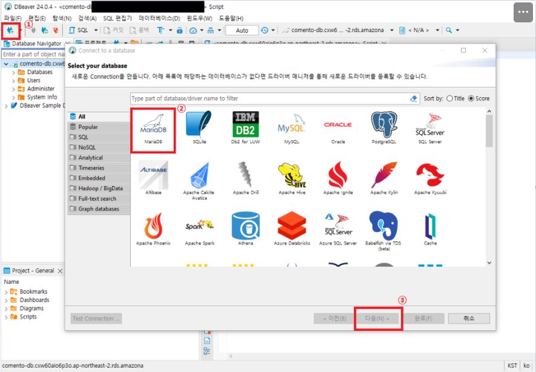
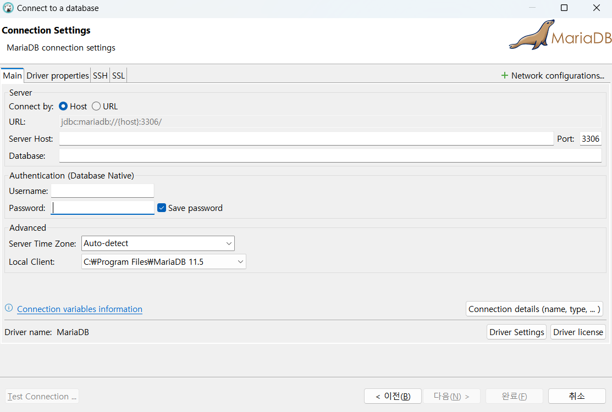
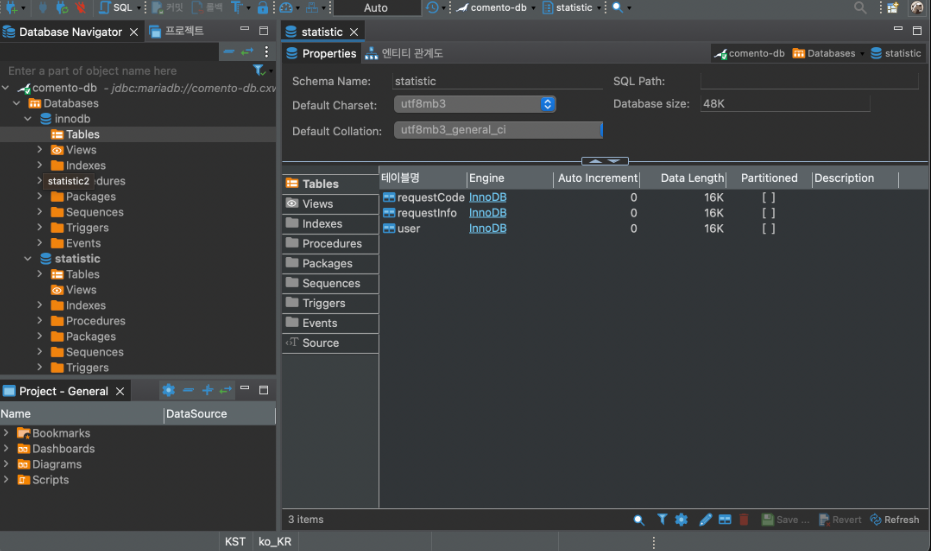
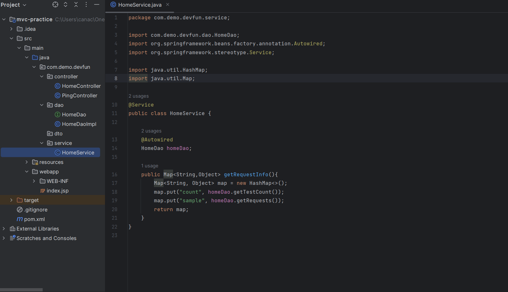
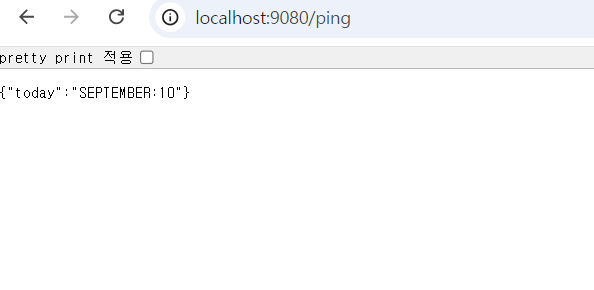
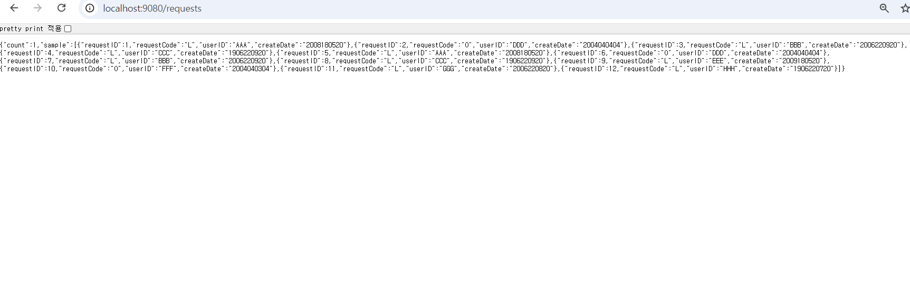

# 1. IntelliJ Community 버전 설치

이미 Intellij Community 버전이 설치되어 있어 따로 설치할 필요가 없었다.

# 2. DBeaver 설치 및 DB Connection
## DBeaver를 사용하는 이유
두 개 이상의 데이터베이스를 사용하게 될 때 각 데이터베이스에 맞는 툴을 따로 설치하고 관리해야하기 때문에 복잡할 수 있다. 그런데 DBeaver 하나로 여러 데이터베이스를 관리할 수 있는 장점이 있기에 사용한다.

## 설치 과정
### 1. 디비버 커뮤니티 버전 다운로드( [https://dbeaver.io/](https://dbeaver.io/) )

### 2. mariaDB 커넥션 진행
1. 커넥션 버튼 클릭
2. DB 선택
3. 다음버튼 클릭

### 3. 커넥션 정보 입력 및 연결

멘토님이 생성하신 데이터베이스(계정)에 연결하였다.

## 결과

DB Connection을 완료했다.

# 3. Spring MVC 환경설정 & API PING

프로젝트 생성 후 controller, dao, dto, service 생성을 완료했고 설정정보를 모두 입력했다.

## 결과

Jetty 실행 후 localhost:9080/ping 을 호출하니 결과가 잘 나왔다.

# 4. datasource & mybatis 연동
datasource 연결을 위해 Pom.xml에 dependency를 추가하고 DB 실행을 위한 dao, controller, service 코드 작성을 완료했다.

## 결과

localhost:9080/requests 을 호출하니 결과가 잘 나왔다.